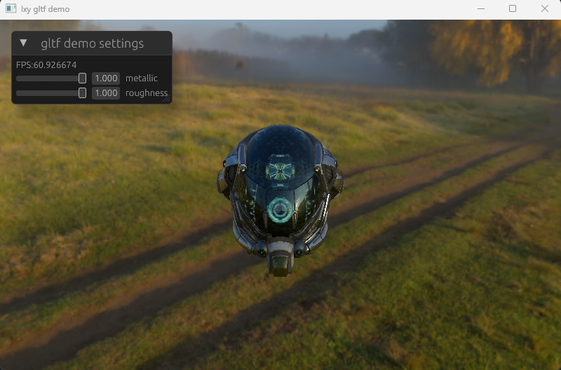
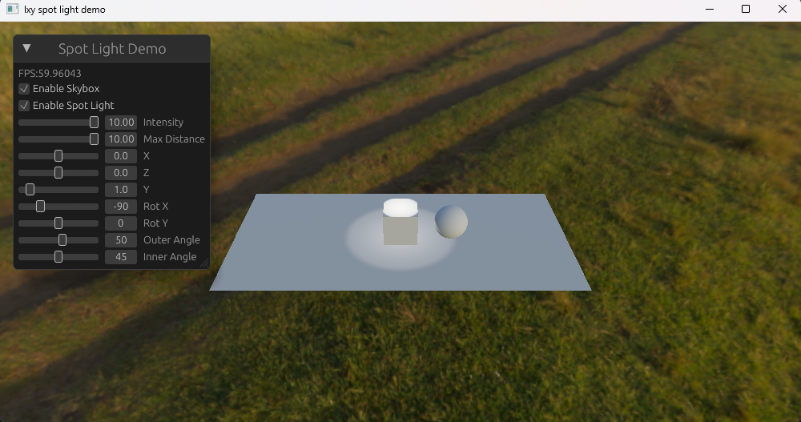

**Imagic** is a thin rendering framework, implemented by Rust and WGPU.

It implements a traditional scene graph based on **arena and index method** instead of ECS.
> I also implement a scene graph with std::rc::Rc and RefCell. It works, but may be not as fast as arena and index. So I decided to use arena and index.
> ECS may be a good choice in some cases. Maybe I will release a version with ECS in the future if necessary.

At the moment, Imagic only supports a few features:
- Materials
    - PBR Material which only supports IBL (image based lighting) now.
    - Unlit Material.
    - Custom Material.
> In fact, there is only one Material struct. PBR, Unlit or custom Materials are all implemented by this Material. The differences are the shaders. The Material will parse the shader source to know what uniforms (including their groups and bindings) are needed. So it is easy to custom shader or material.

- HDR textures
- Multi camera
- Render textures, both 2D and Cube
- Integrated UI framework powered by EGUI
- Support gltf 2.0 partially
- Perspective camera and orbit camera controller
- Orthographic camera
- Storage buffer
- Lights (without shadows)
    - Directional Light
    - Point Light
    - Spot Light
> Lights are implemented by storage buffer.

# To do list
- Implement shadows for directional light, point light and spot light. After that, I would like to write a real game with Imagic and publish it on Steam or itch.io.
- Add more doc comments.
- Add primitives (icosphere, capsule, cylinder, etc.)
- Support transparent materials.
- Implement more kinds of cameras and controller.
- Physics.
- And so on.

> In the remote future, an imagic editor may be released.


# Examples
There are some examples in folder `engine\examples\`.

## GLTF demo

You can run `cargo run --example gltf_demo` to see the `gltf_demo.rs` example:
> - hold left mouse button down and move mouse to rotate camera.
> - hold right mouse button down and move mouse to zoom in and out.




## Spot light demo
You can run `cargo run --example spot_light_demo` to see the `spot_light_demo.rs` example:
> - hold left mouse button down and move mouse to rotate camera.
> - hold right mouse button down and move mouse to zoom in and out.
> - Shadows will be implemented later




There are also `directional_light_demo.rs` and `point_light_demo.rs` examples without shadows now.

# How to use Imagic

The examples are always best tutorials.

Here are some tips:
## The basic boilerplate

```rust
fn main() {
    // 1. create the engine instance, which is the core API.
    let options = EngineOptions {
        window_size: WindowSize::new(800.0, 500.0),
        app_name: "lxy gltf demo",
    };
    let mut engine = Engine::new(options);
    // 2. add nodes to scene or add Behaviors, or anything else.
    load_model(&mut engine);
    create_camera(&mut engine);
    add_skybox(&mut engine);
    
    // 3. launch the engine.
    engine.run();
}
```

For more details, see the `primitives_demo.rs`, `gltf_demo.rs`, `ibl_demo.rs`, `unlit_demo.rs` or other examples.

-----
There exists a tag [v0.1.0](https://github.com/cgdog/imagic/releases/tag/v0.1.0) which is deprecated and has more examples and features, for example, point light, simple ray tracer. But it has no scene management, and have bugs on IBL implementation。
