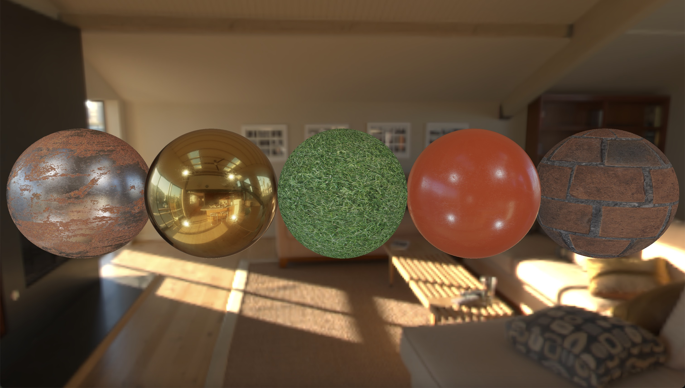
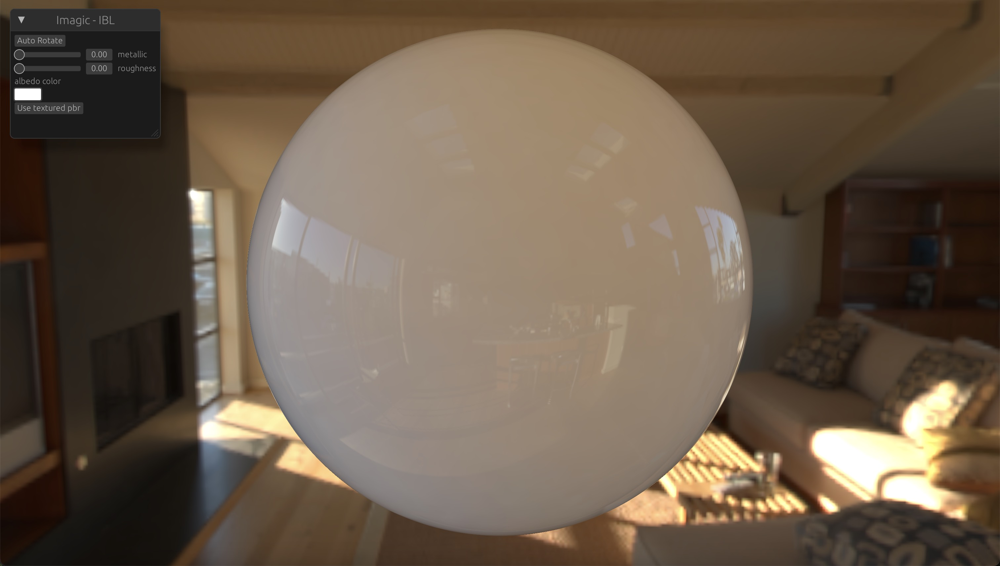
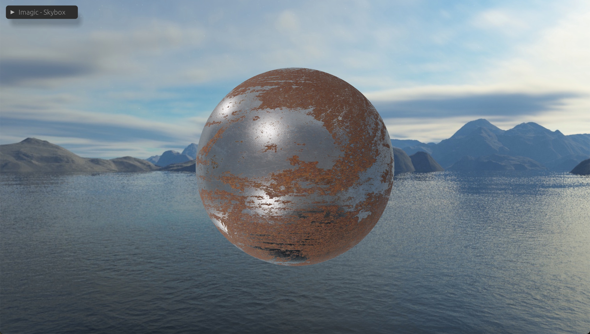
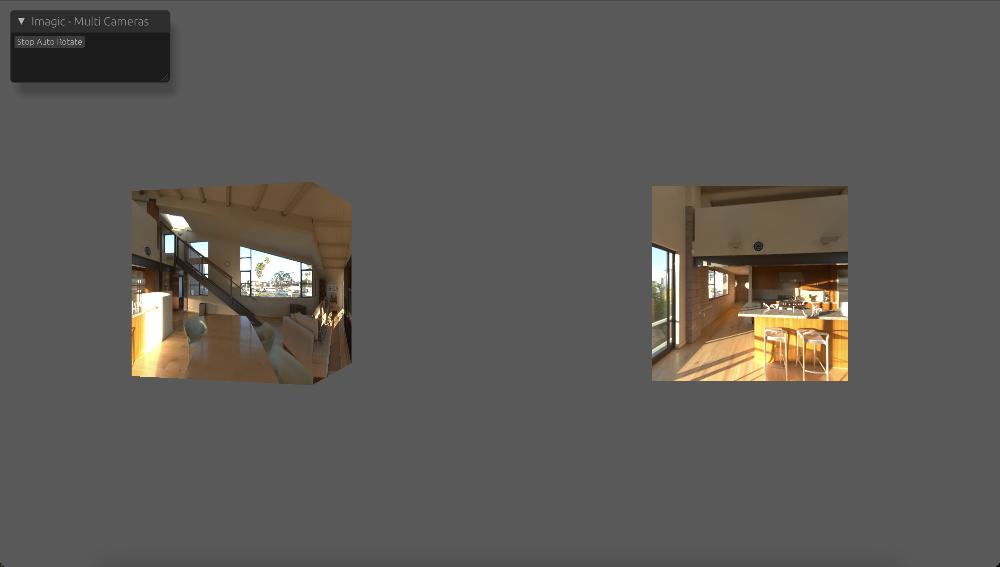

# Intro
*Imagic* is a thin rendering framework, implemented by Rust and WGPU.
> 中文简介：https://zhuanlan.zhihu.com/p/21310925935

For the moment, *Imagic* is at the startup stage, which supports only a few features:
- Materials
    - PBR Material which supports both direct lighting and IBL (Image Based Lighting)
    - Unlit Material
    - Skybox Material
    - Custom Materials or custom shader
- HDR textures
- Light
    - Point Light
    - IBL
- Multi cameras
- Render textures, both 2D and Cube
- Support two methods to generate mipmaps for a Cube Texture by compute shader.
    - Bilinear Filtering
    - Gaussian Filtering with 4x4 samples
- integrated UI framework powered by EGUI

# To do list
- ~~Compete PBR with Imaged Based Lighting~~
- **Improve scene object management. Maybe ECS is a good candidate**
- ~~**Solve flicker of rendering results when camera moves**~~
> The flicker is caused by the lack of 2d texture mipmaps.
- Improve user experience of compute shader
- Improve multi camera (clear color)
> Now only the first camera's clear color is supported. I will fix this problem.
- More rendering feature and effects, for example:
    - **Directional light, spot light**
    - Shadows
    - Transparent
    - Water
    - SSS (Sub-Surface Scattering)
    - Image Processing
    - Terrain generation
    - Light Probes
- Physics
> I have plan to make a game with *Imagic*, maybe physics system is necessary. I'd like to use third party physics crates.

*Imagic* has two repositories:
- [Imagic-gitee](https://gitee.com/computergraphics/imagic)
- [Imagic-github](https://github.com/cgdog/imagic)

# Supported platform
- Windows
- Linux
- MacOS

In theory, it will be easy to support Android, iOS and Web, thanks to Rust and WGPU. I will complete this some day.

# Examples
You can watch these videos of these examples on [Youtube](https://www.youtube.com/watch?v=IbN8F0Dl8Yk&list=PLTnkZwAEijdJPh3AwY7dxzEqH47MjslDh&index=2) or [Bilibili](https://space.bilibili.com/31428391/upload/video).
- [PBR](examples/pbr.rs)
```shell
cargo run --example pbr
```
This example renders five spheres with [PBRMaterial](src/material/pbr_material.rs) with four point lights and IBL. It tries to reproduce the pbr IBL scene from [learnopengl.com](https://learnopengl.com/PBR/IBL/Specular-IBL).


- [IBL](examples/ibl.rs)
```shell
cargo run --example ibl
```
This example only renders IBL effects without direct lighting. And it supports some UI controls to adjust related PBR parameters.


- [skybox](examples/skybox.rs)
```shell
cargo run --example skybox
```
This example shows LDR skybox. And the sphere in the scene is affetctd by 4 point lights and IBL baked from the LDR skybox.
> Other examples use HDR skybox.



- [multi_camera](examples/multi_camera.rs)
```shell
cargo run --example multi_camera
```
This example use two cameras with different viewports to render a box geometry. The left camera rotates automatically.


- [mipmaps](examples/mipmaps.rs)
```shell
cargo run --example mipmaps
```
This example provides slider to change lod and show mipmaps of CubeTexture.
This example also shows how to custom material. It provide a [custom skybox material](examples/common//materials/custom_skybox_material.rs), which exposed lod parameter.

> The name 'Imagic' comes from words 'image' and 'magic'. Initially, I intended to implement an image processing library accelerated with GPU. In fact, I previously created a repository named "imagetoy" locally also powered by Rust and WGPU. I believe Rust and WGPU can do more interesting things beyond just image processing, so I create 'imagic' which provides some basic infrastructures to help me and others deal with more complicated and imaginative things.

Usefull links:
- [learnopengl.com](https://learnopengl.com/)
- [Digital Signal Processing](https://songho.ca/dsp/index.html)