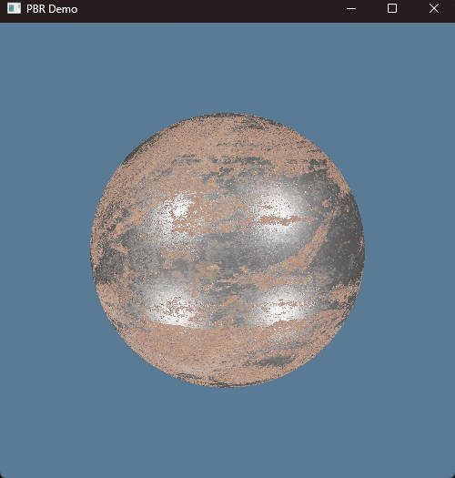
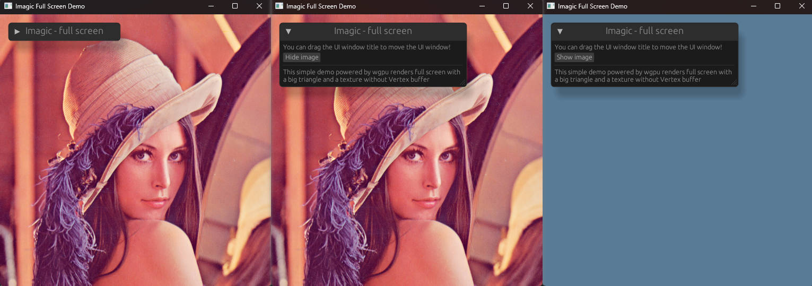

# Intro
*Imagic* is a thin rendering framework, powered by Rust and WGPU.
> The name 'Imagic' comes from words 'image' and 'magic'. Initially, I intended to implement an image processing library accelerated with GPU. In fact, I previously created a repository named "imagetoy" locally also powered by Rust and WGPU. I believe Rust and WGPU can do more interesting things beyond just image processing, so I create 'imagic' which provides some basic infrastructures to help me and others deal with more complicated and imaginative things.


For the moment, *Imagic* is at the startup stage, which supports only a few features:
- Physically Based Rendering (PBR) with only direct lighting
- custom shader
- integrated UI framework powered by EGUI

# Supported platform
- Windows
- Linux
- MacOS

In theory, it will be easy to support Android, iOS and Web, thanks to Rust and WGPU. I will complete this some day.

# Examples
- PBR with only direct lighting
```shell
cargo run --example pbr
```


- Custom shader & UI
```shell
cargo run --example full_screnn
```



# To do list
- Compete PBR with Imaged Based Lighting
- Improve scene object management. Maybe ECS is a good candidate
- Compute shader
- More rendering feature and effects, for example:
    - Water
    - SSS
    - Image Processing
    - Terrain generation


Usefull links:
- [learnopengl.com](https://learnopengl.com/)
- [Digital Signal Processing](https://songho.ca/dsp/index.html)